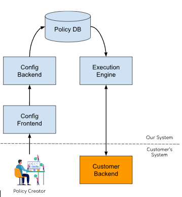
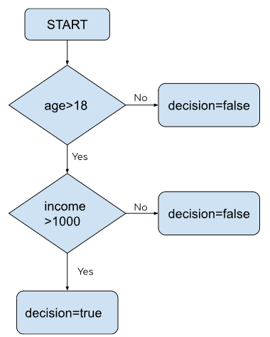

# BackEnd Challenge - Decision Engine

Welcome to the Decision Engine Project, a Backend challenge that explores the creation and execution of policies using a RESTful API. Below, you'll find an overview of the project's functionality.


## What's Going On?




This diagram illustrates the business logic behind the challenge. The goal is to allow the front end to create policies in a decision engine. This engine interprets the provided data and executes the logic, resulting in a true or false decision.

The CustomerBackend is a client system that communicates with our ExecutionEngine through a REST endpoint. It sends a JSON payload containing fields and values relevant to the specific decision.


### Example:

Consider the following decision represented in the diagram:




A request from CustomerBackend will look like:


```bash
{
  "age": 23,
  "income": 3000
}
```

The expected response should be:

```bash
{
  "result": true
}
```

## How Does It Work?

The Backend is a REST API interacting with a PostgreSQL database using Prisma as the ORM.

### Routes

| type | route | description |
|---|---|---|
|POST|`/policy`|Create a new Policy|
|POST|`/execute`|Execute a policy|
|DELETE|`/policy/:policyName`|Delete a policy|
|GET|`/policy/all`|Get all policies|
|GET|`/policy/:policyName`|Get a single policy|


### Policy Logic

A policy consists of a policyName and comparators, which are the decision points interpreted by the engine.


```typescript
type Policy {
  policyName: string
  comparators: Comparators[]
}

type Comparators = {
  id: number
  label?: string
  operator?: string
  referenceValue?: number
  result?: boolean
  type: 'result' | 'compare' | 'start'
  truePath?: number
  falsePath?: number
}
```

Comparators include:


- `label`: The name of the comparator.

- `operator`: The operation to perform. Currently this backend know how to perform with the following operators

 ```bash
'=' | '>=' | '<=' | '>' | '<'
```

- `type`: Indicates if the comparator is a starting point, a decision point, or the end of the comparison.

- `referenceValue`: The value to compare against.

- `truePath` and `falsePath`: Point to the next comparators after the decision is made which is the id off the next comparator


## Example 

Let's create a policy to replicate the decision logic:

 ```bash
if (day == 30) {
    if (creditScore >= 10000) {
        if (dadScore >= 20000) {
          return true
        } else {
          return false
        }
      } else {
        return false
      }
   } else {
  return false
}
```

The corresponding policy creation needs to first check if the day label is 30, second check if the creditScore label is bigger than 10.000, and last check if the label dadScore is bigger than 20000. If all decisions are true, we return true.


So let's create this policy through the post endpoint `'/policy'`. The body of the request will look like this: 
 ```bash
{
	"policyName": "OurFirstPolicy",
	"comparators": [
		{
			"id": 1,
			"type": "start",
			"label": "day",
			"operator": "=",
			"truePath": 2,
			"falsePath": 5,
			"referenceValue": 30
		},
		{
			"id": 2,
			"type": "compare",
			"label": "creditScore",
			"operator": ">=",
			"truePath": 3,
			"falsePath": 6,
			"referenceValue": 10000
		},
		{
			"id": 3,
			"type": "compare",
			"label": "dadScore",
			"operator": ">=",
			"truePath": 4,
			"falsePath": 7,
			"referenceValue": 20000
		},
		{
			"id": 4,
			"type": "result",
			"result": true
		},
		{
			"id": 5,
			"type": "result",
			"result": false
		},
		{
			"id": 6,
			"type": "result",
			"result": false
		},
		{
			"id": 7,
			"type": "result",
			"result": false
		}
	]
}

```

After creating the policy, you can execute it by sending labeled values. 

We can execute the policy through the post `/execute/:policyName` endpoint. 

We need to pass all the labels and the values to be compared against the referenceValue

So a possible body would be like:

```bash
{
   "policyName":"OurFirstPolicy",
   "tests":[
      {"label":"day", "value":30},
      {"label":"creditScore", "value":90000},
      {"label":"dadScore", "value":20000}
   ]
}

# and the result would be

{
	"result": true
}

```

```bash
{
   "policyName":"OurFirstPolicy",
   "tests":[
      {"label":"day", "value":15},
      {"label":"creditScore","value":90000},
      {"label":"dadScore","value":20000}
   ]
}

# and the result would be

{
"result": false
}
```


## How to Execute

-> Clone this repository to your local machine using the following command:

```bash
$ git clone https://github.com/MatheusSanchez/backend-challenge
```

-> Navigate to the project directory and install the required dependencies by running:

```bash
$ npm install
```

-> You need to create a .env file in the project directory to set the required environment variables. 
You can check the provided .env.example file for the necessary variables and their values. .env.example


-> Use Docker Compose to set up the database container. Run the following command in the terminal:

```bash
$ docker compose up -d
```

-> Run Prisma migrations to create the database tables:

```bash
$ npx prisma migrate dev
```

-> Launch the API by running the following command:

```bash
$ npm run dev
```

-> Check the terminal for the message: 

```bash
🔥🔥🔥 HTTP Server Running 🔥🔥🔥
```


## How to Test

Executing Unit tests is pretty simple; just run the following command:

$ npm run test


### E2E tests
There are two scripts in the [package.json](./package.json/) file to set up the E2E tests, as the tests shouldn't add data to the real database.

You can execute the E2E tests using the following command:
```bash
$ npm run test:e2e
```

This script will trigger all the setup, and a new database will be generated to run the tests, which will be deleted after the tests are completed.

You can also check the tests through  a UI and check the coverage, use the following commands:
```bash
$ npm run test:ui
$ npm run test:coverage
```
